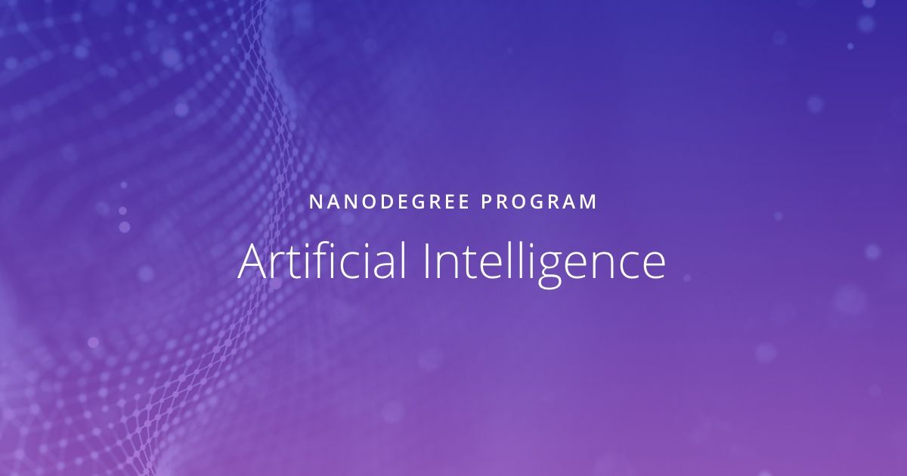

# AIPND-learning
Code and associated files for the AI Programming with Python Udacity Nanodegree Program

This repository contains the code files that I have used, filled in or created to accompany my learning throughout the course of the AI with Python Nanodegree offered at Udacity.

# Author
- Dilay Fidan Ercelik

# License
This work is licensed under the MIT License - see [LICENSE.txt](https://github.com/dilayercelik/AIPND-learning/blob/master/LICENSE.txt)
